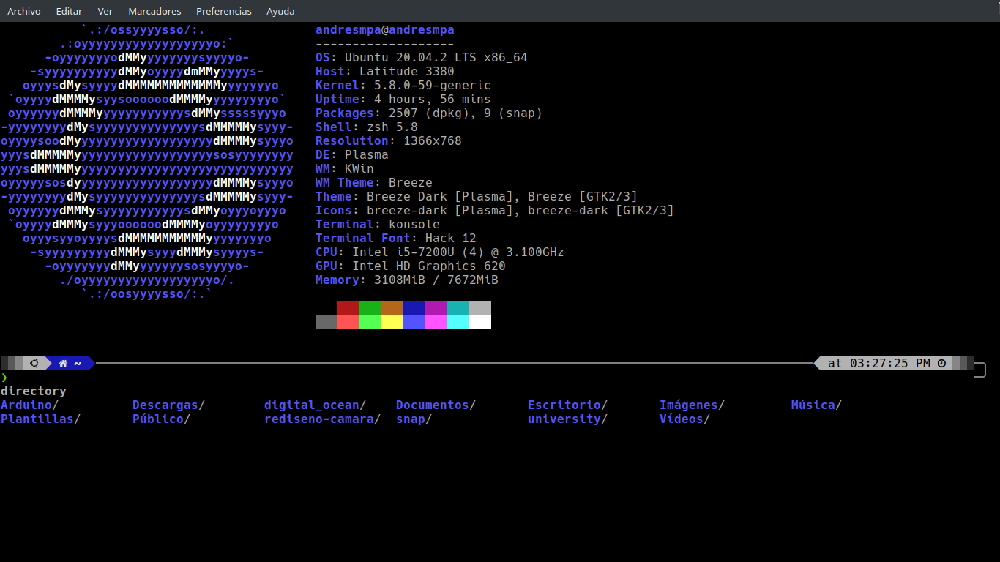

# DESL

The Developer Environments Setter for Linux
(DESL) is a feature developet for developers
to create Linux terminal develop environmets,
this is easy to use and useful to get a full
functiona terminal, with all the things you
migth need, also it helps new user to get
involved in unix

## Usage

This is quite simple to use, just run the
following commands:

`$ git clone https://github.com/AndresMpa/desl.git`
`$ cd desl `
`$ source ./install.sh`

## Example

#### apt

## Supported packages managers

If you don't know your package manager check
just check it with neofetch, or check your
the documentation of your OS to get extra
information

- apt
- pacman
